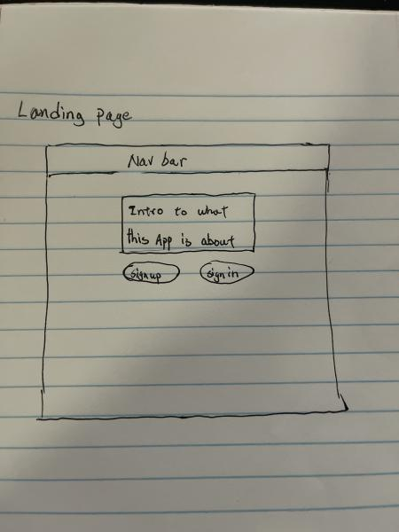
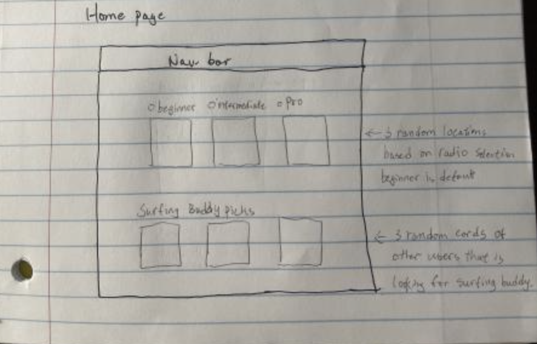
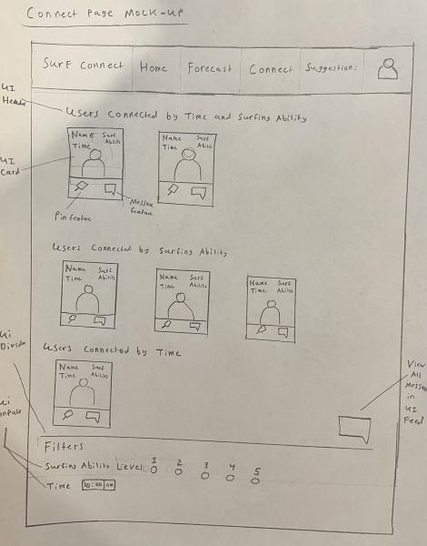
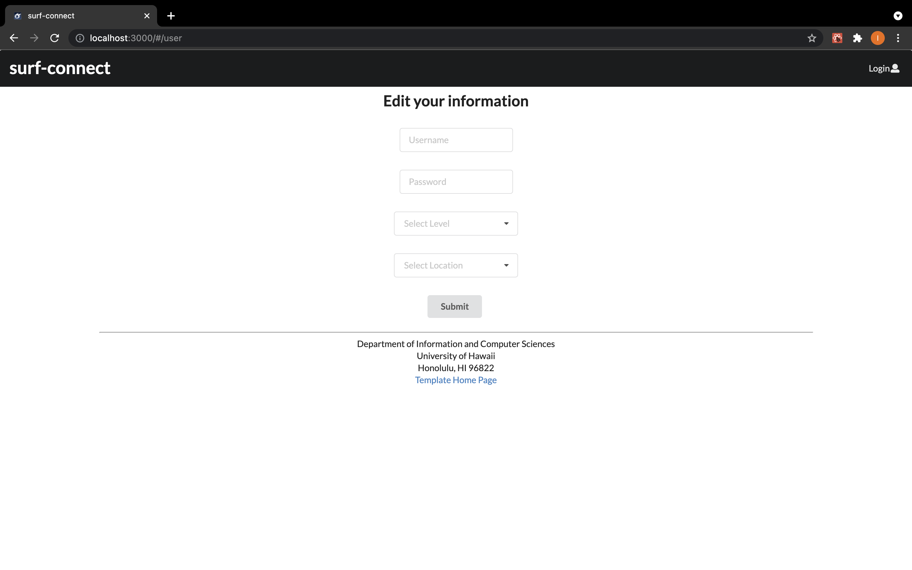
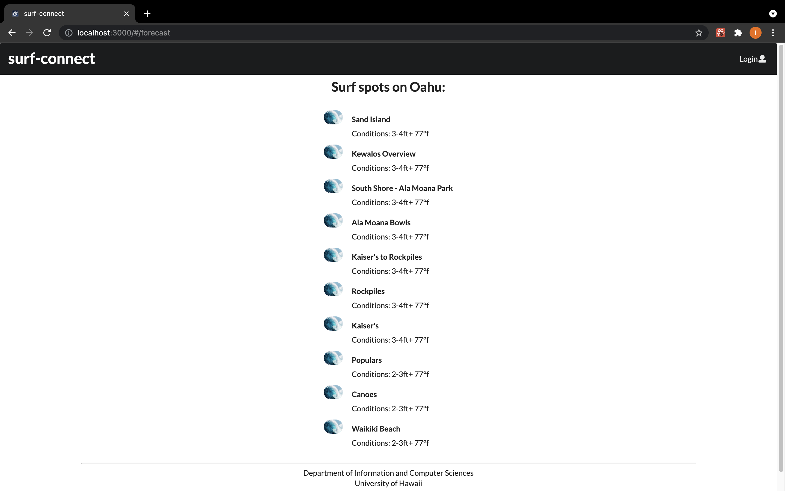
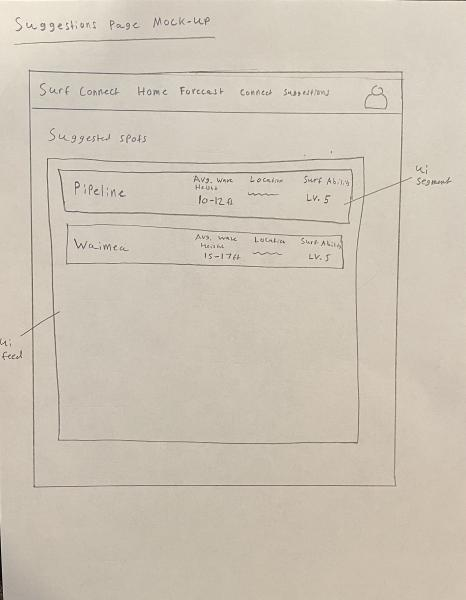

## Table of contents

* [Overview](#overview)
* [User Guide](#user-guide)
* [Development History](#development-history)
* [Team](#team)

## Overview

Surf Connect is a web application that address the problem where UH students from outside of Hawaii have trouble trying to surf. Surf Connect will make this easier for these students by recommending surf locations based on their surfing ability and location. Surf Connect will also connect students together with similar surfing ability and similar times they would like to surf. By doing this, Surf Connect addresses the overall issue by providing a location for students to surf, connect with others to have fun, and provide details on surf conditions to ensure saftey. Below are more specific goals Surf Connect must meet to be a successful application:

* Must provide the user with surf locations that match their surfing ability and location.
* The application must support multi-users that can login, logout and access their previous data.
* Must allow users to interact with each other through some kind of private message system or like system.
* The surf reports for the surf locations must be updated everyday based on actual data.
* Must filter out users with similar surfing ability and similar times the users would like to surf.

## User Guide
This section provides a walkthrough of the Surf Connect user interface and its capabilities.

### Landing Page
The landing page is presented to users when they visit the top-level URL to the site.

### Home Page
After logging in, you are taken to the home page, which allows users to view surfing spots around Oahu.

### Connect Page
Users are connected to each other based on surfing ability and the time of day they would like to surf. Users are able to click a message button on the user to message them or pin them by pressing a pin button to get their attention.

### User Page
The User page allows users to edit their account information, and set their surfing level and location.

### Surf Forecast Page
The Surf Forecast page displays a list of surf spots and allows users to view updated surf forecasts for each surf spot.

### Suggestions Page
The Suggestions page displays a list of surf spots based on the user's surfing ability

## Development History

### Milestone 1: Create HTML Mockup Pages
Our main goal for milestone 1 is to create all of the HTML mockup pages using Semantic UI and React. By doing this, we will have a rough skeleton of the ui, so that we can figure out later how the data model will work to create user functionality.
Milestone 1 was managed using [Surf Connect Github Project Board M1:](https://github.com/surf-connect/surf-connect/projects/1)

## Team
* [Charlie Robison](https://charlie-robison.github.io/)
* [Jonathan Ma](https://jonathan-ma.github.io/)
* [Ian Manzano](https://ianbm.github.io/)
