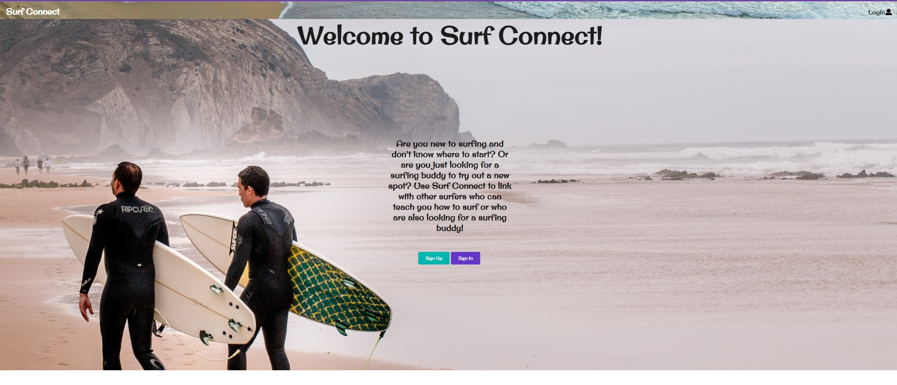
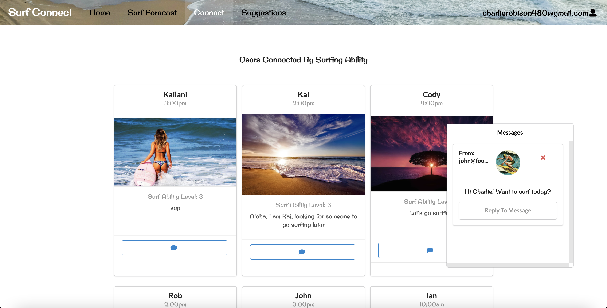
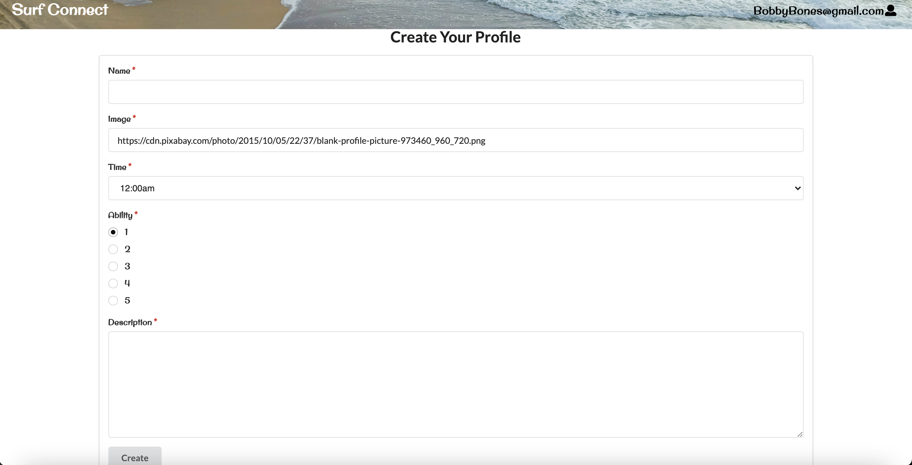
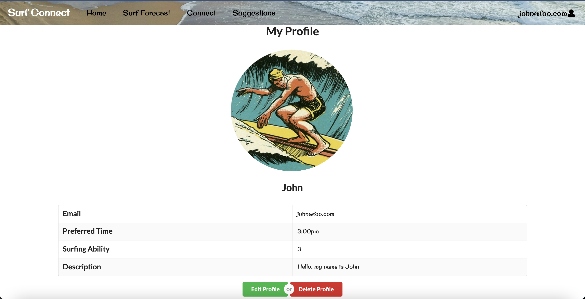
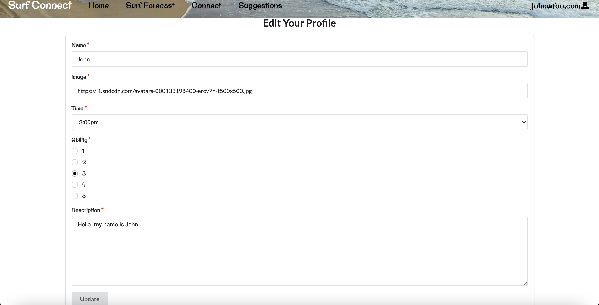
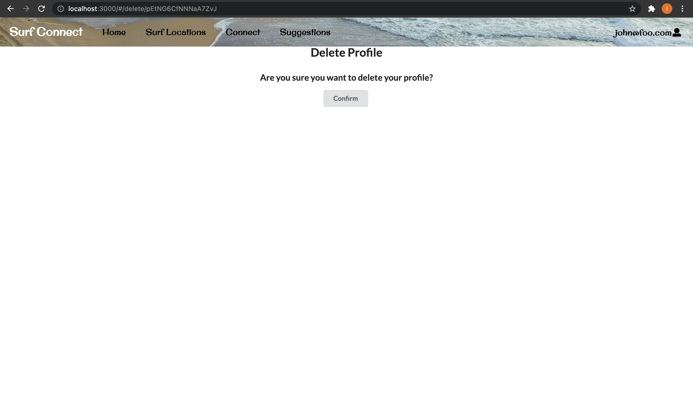

## Table of contents
* [Links](#links)
* [Team](#team-members)
* [Overview](#overview)
* [User Guide](#user-guide)
* [Community Feedback](#community-feedback)
* [Developer Guide](#developer-guide)
* [Development History](#development-history)

## Links
* [Deployed app](https://surf-connect.xyz/#/)
* [Repository](https://github.com/orgs/surf-connect/repositories)

## Team Members
* [Charlie Robison](https://charlie-robison.github.io/)
* [Jonathan Ma](https://jonathan-ma.github.io/)
* [Ian Manzano](https://ianbm.github.io/)

## Overview

Surf Connect is a web application that address the problem where UH students from outside of Hawaii have trouble trying to surf. Surf Connect will make this easier for these students by recommending surf locations based on their surfing ability. Surf Connect will also connect students together with similar surfing ability and similar times they would like to surf. By doing this, Surf Connect addresses the overall issue by providing a location for students to surf, connect with others to have fun, and provide details on real-time surf conditions to ensure safety. Below are more specific goals Surf Connect must meet to be a successful application:

* Must provide the user with surf locations that match their surfing ability and location.
* The application must support multi-users that can login, logout and access their previous data.
* Must allow users to interact with each other through some kind of private message system.
* The surf reports for the surf locations must be updated everyday based on actual data.
* The user must be able to edit their profile so that they can change their surf ability and time they would like to surf when necessary. 

## User Guide
This section provides a walkthrough of the Surf Connect user interface and its capabilities.

### Landing Page
The landing page is presented to users when they visit the top-level URL to the site.


### Home Page
After logging in, you are taken to the home page, which presents users top surfing locations around Oahu and randomly picked users that you can reach out to be surfing buddies.


### Connect Page
Users are connected to each other based on surfing ability and the time of day they would like to surf. Users are able to click a message button on the user to message them or reply to other users that messaged them by pressing the message box on the bottom right of the screen.


### User Page
If the logged in user has not already created a profile, they can do so by clicking on their email at the top right then selecting "My Profile." This will take the user to the Create Profile form:


After a profile is created, selecting "My Profile" again will take the user to the User page which displays their information:


The "Edit Profile" button will take the user to the Edit Profile form which allows the user to edit their profile:


The "Delete Profile" button will take the user to the Delete Profile form which allows the user to delete their profile:


### Surf Forecast Page
The Surf Forecast page displays a list of surf spots and allows users to view updated surf forecasts for each surf spot. All surf spots are updated daily based on real surf data on Oahu. 


### Suggestions Page
The Suggestions page displays a list of surf spots based on the user's surfing ability.


## Community Feedback
Our first feedback we got was that there was a bug where the connect page and suggestions page do not work with new accounts. This is due to the fact that our suggestions page and connect page only shows users people to connect with and locations based on their own ability level. Therefore, a new user that signs up will have a blank profile page and no ability level selected so no suggestions will show.

Another bug was the live surf data retrieved from the Surfline api. Once our app was deployed, the data loaded (surf location name and wave height etc.) will become static because we do not have an authorization key to keep updating from the api. This was solved by using a different api that does not require any authorization.

A few users complained that for some surfing ability levels there are no location suggestions for their level. This is due to the fact that we rely on real-time data for suggestions. For example, North Shore might be firing today so level 5 surfers might get a full page of location suggestions while level 3 and below might simply get a blank page.

One user pointed out that the Surf Forecast page may look weird depending on the browser. For example, when viewing the app with the Chrome browser everything looks fine. But on the Safari browser, the background image of each location appears to be repeated for each column in the table.

Another user said that the application was very nice and helpful for connecting surfers together, however, she mentioned that the aesthetics of the application looked poor on an iPhone since all the ui elements were scrunched up together. This may be a good thing to fix going forward.

## Developer Guide
First things first, clone the [repository](https://github.com/surf-connect/surf-connect) to your machine. Next, you'll want to create a project in your IDE and point it to the repository. After all that is set up, run ```meteor npm run install```, this installs all the necessary packages Meteor needs. Now you can run the project using the command ```meteor npm run start``` and make any changes you like to the application!

## Link to Deployed App
#### [The Surf Connect Website](https://surf-connect.xyz/#/)

## Development History

### [Milestone 1](https://github.com/surf-connect/surf-connect/projects/1)

### [Milestone 2](https://github.com/surf-connect/surf-connect/projects/2)

### [Milestone 3](https://github.com/surf-connect/surf-connect/projects/3)

